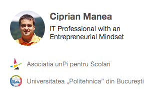
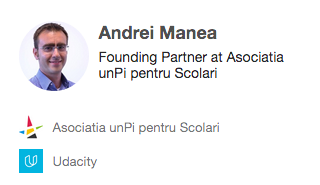
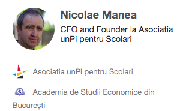

### Echipa fondatoare

  

### Statut: "Asociația unPi pentru Școlari" este activă din 19.09.2019 certificat 22/I/A/2019

### Conturi: Asociația unPi pentru Școlari, Banca Transilvania, cod BIC/SWIFT BTRLRO22DBA

- cod IBAN RO31BTRLRONCRT0523621201 pentru donații în RON [sold curent: 2029.59 RON]
- cod IBAN RO78BTRLEURCRT0523621201 pentru donații în EUR [sold curent: 121.65 EUR]
- cod IBAN RO82BTRLUSDCRT0523621201 pentru donații în USD [sold curent: 0.00 USD]

### Contacte

- pentru donații / sponsorizări către [unPi](https://www.unpi.ro/), vezi te rog pagina [donez](https://start.unpi.ro/donez/), sau vrei să [devii voluntar?](https://start.unpi.ro/ong/voluntar/)
- pentru a primi în dar [unPi, mic calculator personal](https://start.unpi.ro/spec/pc/), vezi te rog pagina [vreau unPi](https://start.unpi.ro/vreau/)
- pentru a primi raportul anual (pe scurt) pe email, te poți [înscrie în lista de distribuție](mailto:raport@unpi.ro?subject=vreau%20un%20scurt%20raport%20anual)
- telefon: [mobil](tel:+358406640059) +358406640059 (de luni până vineri, de la 6pm la 8pm; SMS oricând)
- email: [presă](mailto:presa@unpi.ro), [întrebări generale](mailto:intrebari@unpi.ro), [probleme cu unPi](mailto:probleme@unpi.ro) (_doar pentru beneficiari_)
- pe Internet: [Telegram](https://t.me/unpi_ong), [Twitter](http://twitter.com/unpi_ong), [LinkedIn](https://www.linkedin.com/company/asociatia-unpi-pentru-scolari/), [Facebook](https://www.facebook.com/unpi.ro/), [TikTok](https://www.tiktok.com/@unpi.ro) și [NU Whatsapp](http://whatsapp.unpi.ro)

### Membri de Onoare (_doar inițialele numelui_)

BS DD LL SS PS RB MV AG CR SN SP DT DM SG CB RB CO CS (donatori, _doar_ seria #1)
