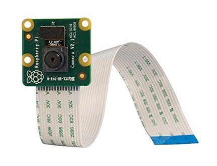
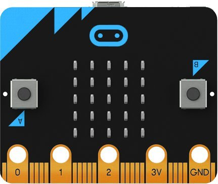

## recompense motivaționale

#### cum participarea școlarului în proiectul unPi va necesita **multă muncă individuală** pentru a invăta și practica conceptele folosite în programare, plus a rezolva exercițiile temă, ne gândim să oferim și una din următoarele recompense _după 1 an_ de activitate, doar elevilor unPi cu rezultate și implicare _excepționale_:

##### _(inițial recompensele sunt doar pentru prima serie de donații, seriile următoare vor primi recompense doar dacă reușim să atragem donații pentru ele)_

---

1. radio programabil pentru unPi care [poate detecta avioanele](https://www.amazon.de/gp/product/B00VZ1AWQA/) ce zboară deasupra casei tale (trebuie să-i ții antena aproape de fereastră)

---

2. [camera Raspberry Pi versiunea 2](https://www.amazon.de/gp/product/B01ER4FA9U/) pentru unPi

---

3. display/[ecran foarte mic](https://www.amazon.de/gp/product/B06X191RX7/) pentru unPi

---

4. procesor [Micro Bit](https://www.amazon.de/gp/product/B01G8X7VM2/) pentru programatori adevarați (în devenire)

---

5. [căști cu microfon](https://www.amazon.de/gp/product/B07PPFP8YN/) pe USB pentru unPi

