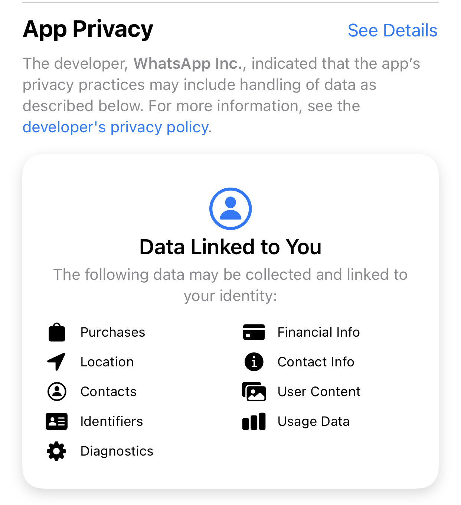

## NU WhatsApp!

#### Deși inițial ne gândeam să folosim _WhatsApp_ pentru comunicarea cu clienții [unPi](https://www.unpi.ro/), am hotărât să **NU folosim WhatsApp**, din motive de securitate informatică (a noastră și mai ales a ta, client sau beneficiar **unPi**).

##### Articole publicate în presă, pe Internet care motivează această decizie:

- [Informația din grupurile private este vizibilă pe Internet, publicat de DW](https://translate.google.com/translate?hl=&sl=auto&tl=ro&u=https%3A%2F%2Fwww.dw.com%2Fen%2Fwhatsapp-security-flaw-over-60000-groups-still-accessible-online%2Fa-52543414) [[original](https://www.dw.com/en/whatsapp-security-flaw-over-60000-groups-still-accessible-online/a-52543414) din 2020]

- [(să nu ai) Încredere în Whatsapp, publicat de Forbes](https://translate.google.com/translate?sl=auto&tl=ro&u=https%3A%2F%2Fwww.forbes.com%2Fsites%2Fkateoflahertyuk%2F2020%2F02%2F29%2Fwhatsapp-security-is-this-hidden-flaw-a-new-reason-to-leave%2F%23749ade5b90b6) [[original](https://www.forbes.com/sites/kateoflahertyuk/2020/02/29/whatsapp-security-is-this-hidden-flaw-a-new-reason-to-leave/) din 2020]

- [Major security flaw in Whatsapp, publicat de CNN](https://edition.cnn.com/2019/05/14/tech/whatsapp-attack/index.html) (numai în limba engleză) [2019]

- [Impresii și Critică - Whatsapp, publicat de Wikipedia](https://translate.google.com/translate?sl=auto&tl=ro&u=https%3A%2F%2Fen.wikipedia.org%2Fwiki%2FReception_and_criticism_of_WhatsApp_security_and_privacy_features) [[original](https://en.m.wikipedia.org/wiki/Reception_and_criticism_of_WhatsApp_security_and_privacy_features) din 2019]

- [Nu mai folosi Whatsapp, publicat de LifeHacker](https://translate.google.com/translate?sl=auto&tl=ro&u=https%3A%2F%2Flifehacker.com%2Fstop-using-whatsapp-if-you-care-about-your-privacy-1825719172) [[original](https://lifehacker.com/stop-using-whatsapp-if-you-care-about-your-privacy-1825719172) din 2018]

- [Firmele mari interzic angajaților să folosească Whatsapp, publicat de ZDNet](https://translate.google.com/translate?sl=auto&tl=ro&u=https%3A%2F%2Fwww.zdnet.com%2Farticle%2Fwhatsapp-is-among-the-most-blacklisted-apps-in-the-enterprise%2F) [[original](https://www.zdnet.com/article/whatsapp-is-among-the-most-blacklisted-apps-in-the-enterprise/) din 2017]

---

