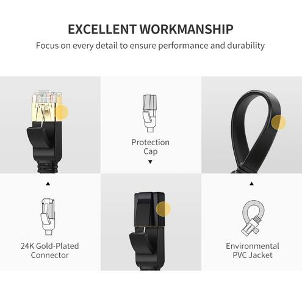

## Calculatorul Personal [unPi](https://www.unpi.ro/)

> unPi este un [mic calculator personal](https://www.raspberrypi.org/products/raspberry-pi-3-model-b-plus/) (cât să-ți încapă într-o palmă), nou, care se conectează direct la TV pe portul HDMI. Primești de asemenea o tastatură US cu trackpad incorporat și un cablu de rețea profesional. Vezi mai jos.

### Cum arată calculatorul tău unPi după ce-l despachetezi

### Cum arată calculatorul tău unPi după ce-l asamblezi

### Ce conține în interior calculatorul tău personal unPi

1. port [extensii electronice](https://www.adafruit.com/categories/405) GPIO cu 40 de pini
2. antenă wireless 2.4 & 5GHz 802.11.b/g/n/ac și BLE 4.2
3. [controller DSI pentru ecran digital cu sensor touch](https://www.adafruit.com/categories/804)
4. [microSD](https://www.amazon.de/Samsung-Micro-Class-Speicherkarte-Adapter/dp/B06XFSZGCC/) (portul este în realitate pe spatele plăcii)
5. [alimentare la curent 5V 2.5A](https://www.amazon.de/gp/product/B07G9V43VR/) cu port/cablu microUSB
6. 4x microprocessor Cortex-A53 (ARMv8) 64-bit @ 1.4GHz
7. port [generic HDMI](https://www.amazon.de/AmazonBasics-HL-007306-Hochgeschwindigkeits-HDMI-Kabel-Ethernet-4K-Videowiedergabe-Schwarz/dp/B014I8SSD0/) (conectare la TV ori un ecran HDMI)
8. port CSI pentru a conecta o [cameră Raspberry Pi](https://www.raspberrypi.org/products/camera-module-v2/)
9. [port analogic pentru audio (stereo) și composite video](https://www.adafruit.com/product/2881)
10. [port Ethernet / RJ45](https://www.amazon.de/gp/product/B00QV1F160/) (viteză maximă totală **300 Mbps**)
11. 4x port(uri) seriale USB 2.0 (pentru [diverse](http://plus.unpi.ro/) accesorii USB)
12. suport [PoE](https://en.wikipedia.org/wiki/Power_over_Ethernet) (necesită [PoE HAT](https://www.raspberrypi.org/products/poe-hat/), achiziționată separat)
13. (nu este arătată mai sus) memorie 1GB LPDDR2 SDRAM

### Cum arată [tastatura US cu trackpad incorporat](https://www.amazon.de/gp/product/B07HG5Q851/) pentru [unPi](https://www.unpi.ro/)

 

### Cum arată [cablul profesional de rețea](https://www.amazon.de/gp/product/B00QV1F160/), viteză maximă **10 Gbps**

 
